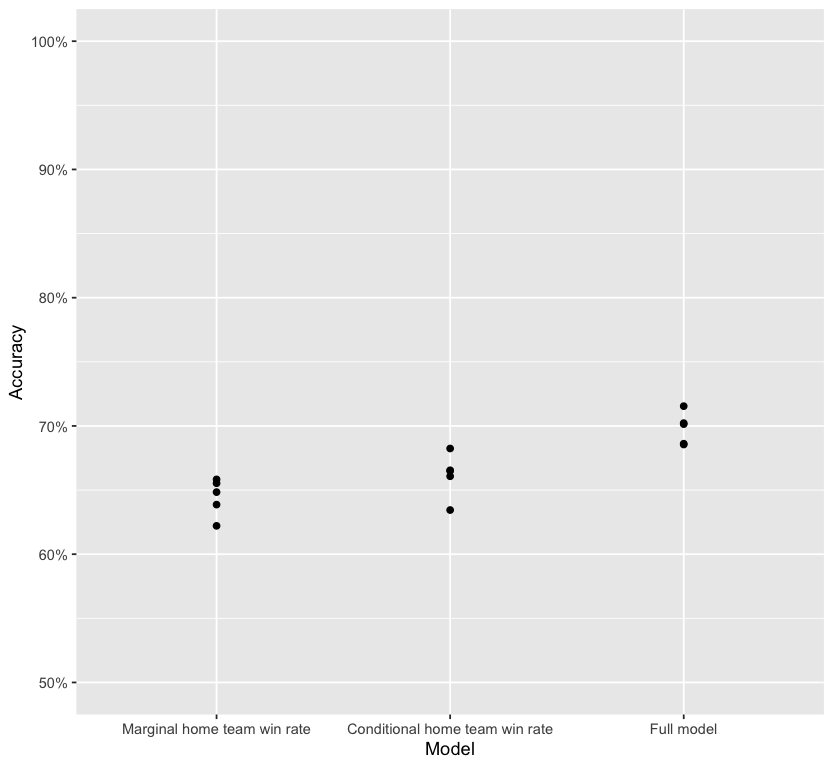

# Heirarchical modeling for men's NCAA basketball rankings

Author: Andrew Bartnof

Date: February 2026

## Scripts

**collect_data.py**: Collect raw game data

**elt_game_scores.py**: Aggregate the scores for each game

**filter.py**: Filter to teams that have played at least 5 games at home, and 5 games away

**check_num_components.R**: Ensure that all of the NCAA teams exist in the same universe

**lmer_one_row.R**: Run hierarchical modeling

**goodness_of_fit.R**: Test accuracy of hierarchical modeling using cross-validation

**Extra:**

**lmer_repeated_measures.R**: An extra model that models home-team advantage as a fixed-effect

## Introduction

March Madness is coming up, and I thought it would be fun to find a way to model team ability going into the tournament. The problem when we rank teams is that very strong teams in very weak conferences can have very attractive win-loss numbers; while average teams in very strong conferences can have quite dismal win-loss numbers. We need a power ranking that takes the difficulty of the competition into consideration!

When raw metrics don't tell the whole story, we often turn to latent variable analytics. But basketball matches present a strange condition for latent variable thinking. This is because latent variable analysis models are generally fitted to situations where a lot of individuals each try to complete the same task (like a standardized test); they're not generally fitted to situations where two teams compete pairwise against each other.

Doran et al. (2007) suggest that you can actually use hierarchical modeling to model skill in situations too complex for conventional latent variable analyses. And that is what we'll do here! Let's break some office March Madness pools!

## Hypothesis

My hypothesis was that by feeding NCAA men's basketball scores into a hierarchical model in R, I could model team ability. I test two things:

1.  Precondition: whether all of the teams in the NCAA form one network, or multiple networks. We need some degree of interconnectedness between teams— how could you compare any team's capabilities to a team that plays in a (metaphorical) bubble?
2.  Whether a hierarchical model outperforms a simpler model.

## Methods

The game data was collected using the Python sportsdataverse package for 2025-2026. (NB I'm assuming this package works well.) If a team hadn't played both 1. at least 5 home games, and 2. at least 5 away games, I omitted it.

Then, I used the R iGraph package to make sure all of the teams are interconnected in a single network of play; this was true.

I fit the hierarchical models using the following equation in the R lme4 package:

`did_home_team_win ~ 0 + (1|home_team) + (1|away_team)`

I suppressed the intercept, and fit random intercepts for both home_team and away_team. Conceptually, this means that if the skill of the home team is greater than the skill of the away team, then the home team won. The difference between a team's home_team score, and its away_team score, is that team's home-team advantage; it is different for each team.

In order to judge the goodness-of-fit for this model, I ran 5-fold cross-validation on the model, and saved the residuals from the test data sets. I compared these residuals with the residuals from two other simplified models:

1.  Marginal home team win rate. Based on the training data, what is the likelihood that any home team will win? Use this as the probability that the home team wins every match.
2.  Conditional home team win rate. Based on the training data, what is the likelihood that each particular home team will win (irrespective of their visiting opponent)? Use this as the probability that each home team will win, respectively.

## Results

The teams were all interconnected— this allows us to continue modeling!

You can see the team skill estimates in a csv in this repo.

There was no question that the hierarchical model would output some measure of relative skill for each team. The question was, how well did the model fit the data? And did it fit the data better than cheaper models?

| Model                          | Median Cross-Validation Accuracy (five-folds) |
|-----------------------------|-------------------------------------------|
| Marginal home team win rate    | 0.648                                         |
| Conditional home team win rate | 0.665                                         |
| Full model                     | 0.701                                         |

: Median Cross-Validated Model Accuracy

On one hand, the full model had quite good predictive power. Even without including such important features as margin of victory, total points scored, or game date, this model was accurate for 70% of the testing data. Pretty good!

On the other hand, even though the hierarchical model outperformed the smaller models, it's worth noting just how well those models performed. The marginal rate model was accurate in 64.8% of the test cases; the conditional rate model was accurate in 66.5% of the test cases. To be clear, these impoverished models do not even consider who the opposing away team is in any game. Remarkable!

Recall that in the hierarchical model, home and away skill levels are modeled distinctly from each other. The Spearman's rank correlation coefficient between these two is -0.735 (negative because they're modeled as opposing forces for any given game). This is a pretty strong correlation. The reason why they do not correlate perfectly at -1 is because this model implicitly models the home-team advantage for each team, and this is different for each team.

The hierarchical model works really well if you know where two teams will play. But in a tournament setting, you might not know that. As a result, I think the easiest solution is just to add the absolute beta values for away and home games. If you know this 'composite score' for two teams, we should get a pretty accurate prediction of who will win.

## Appendix: Extra Model

Note: for fun, I also tested a model that expressed each game in two rows, and used game_id as a repeated measure variable. This model takes input like this:

|        |         |         |        |          |
|--------|---------|---------|--------|----------|
| is_win | game_id | is_home | target | opponent |
| 1      | game_1  | 1       | Foo U  | Bar U    |
| 0      | game_1  | 0       | Bar U  | Foo U    |

This model has a formula like this:

`is_win ~ 0 + is_home + (1|game_id) + (1|target) + (1|opponent)`

This model works quite well as well, but I only include it here out of an obligation for completeness. The difference between this model and the previous model is that this model encodes the home-team advantage as a fixed-effect variable; this means that the home-team advantage is considered the same for all teams. This is conceptually nice (because of its parsimony), but I think it's conceptually unnecessarily rigid.
